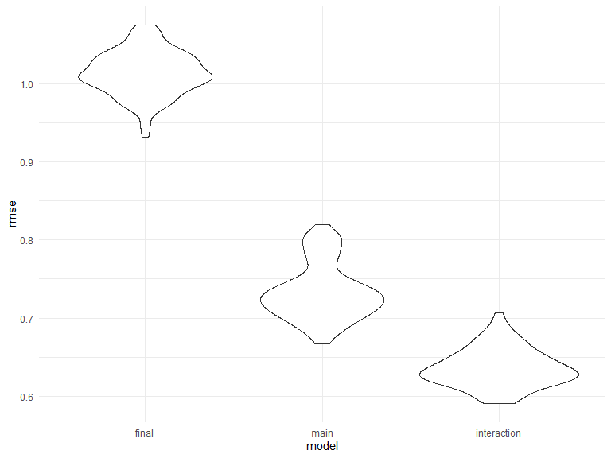

p8105\_hw6\_nk2814
================
Naama Kipperman
11/21/2019

#### Problem 1

Import and clean birthweight data for regression
analysis.

``` r
# Load and clean the data for regression analysis (i.e. convert numeric to factor where appropriate, check for missing data, etc.).

# I converted bwt to lbs from grams, and also created a binary variable indicating whether the mother smoked at least 1 cigarette per day during pregnancy

birthweight =
  read.csv("birthweight.csv") %>% 
  janitor::clean_names() %>% 
  mutate(
    id = 1:4342,
    babysex = as.factor(babysex),
    frace = as.factor(frace),
    malform = as.factor(malform),
    mrace = as.factor(mrace),
    bwt = bwt/453.592,
    cigarettes = if_else(smoken==1, "none", "at least 1")
  ) 
```

Propose a regression model for birthweight. This model may be based on a
hypothesized structure for the factors that underly birthweight, on a
data-driven model-building process, or a combination of the two.
Describe your modeling process and show a plot of model residuals
against fitted values – use add\_predictions and add\_residuals in
making this plot.

*I am choosing the method based on my own hypotheses about factors that
underly
birthweight.*

``` r
# First, I'll fit a preliminary simple linear regression model, regressing maternal pre-pregnancy weight (lbs) on birthweight (lbs).

fit1 = lm(bwt ~ ppwt, data = birthweight) %>% 
  broom::tidy() %>% 
  select(term, estimate, p.value) %>% 
 knitr::kable()

fit1
```

| term        |  estimate | p.value |
| :---------- | --------: | ------: |
| (Intercept) | 5.6012212 |       0 |
| ppwt        | 0.0102426 |       0 |

``` r
# Linear model 'fit1' is highly significant with one predictor. However, I have good reason to think that more variables than just pre-pregnancy maternal weight (ppwt) affect birthweight. 
# In addition to biological variables, there are known associations between maternal race and birth outcomes in the United States. Thus, I proceed to fit maternal race into the model, along with baby's sex.
# For my maternal race variable (mrace), there are 4 categories.
# mrace:  1 = White, 2 = Black, 3 = Asian, 4 = Puerto Rican
# for babysex: 1 = male, 2 = female.


fit2 = lm(bwt ~ ppwt + babysex + mrace, data = birthweight) %>% 
  broom::tidy() %>% 
  select(term, estimate, p.value) %>% 
  knitr::kable()

fit2
```

| term        |    estimate |   p.value |
| :---------- | ----------: | --------: |
| (Intercept) |   5.9954003 | 0.0000000 |
| ppwt        |   0.0103999 | 0.0000000 |
| babysex2    | \-0.1774785 | 0.0000000 |
| mrace2      | \-0.6956585 | 0.0000000 |
| mrace3      | \-0.0811430 | 0.6190676 |
| mrace4      | \-0.3682900 | 0.0000003 |

``` r
# I also suspect that there might be an interaction between maternal race and pre-pregnancy weight - in other words, I suspect that the linear relationship betwene pre-pregnancy weight and birthweight is not uniform across racial categories.

# Linear model 'fit1' is highly significant with one predictor. However, I have good reason to think that more variables than just pre-pregnancy maternal weight (ppwt) affect birthweight. 
# In addition to biological variables, there are known associations between maternal race and birth outcomes in the United States. Thus, I proceed to fit maternal race into the model, along with baby's sex.
# For my maternal race variable (mrace), there are 4 categories.
# mrace:  1 = White, 2 = Black, 3 = Asian, 4 = Puerto Rican
# for babysex: 1 = male, 2 = female.


fit3 = lm(bwt ~ ppwt + babysex + mrace + ppwt*mrace, data = birthweight) %>% 
  broom::tidy() %>% 
  select(term, estimate, p.value) %>% 
  knitr::kable()

fit3
```

| term        |    estimate |   p.value |
| :---------- | ----------: | --------: |
| (Intercept) |   5.8495965 | 0.0000000 |
| ppwt        |   0.0115729 | 0.0000000 |
| babysex2    | \-0.1768686 | 0.0000000 |
| mrace2      | \-0.3725607 | 0.0724651 |
| mrace3      |   0.7203225 | 0.6142037 |
| mrace4      | \-0.8808463 | 0.0597474 |
| ppwt:mrace2 | \-0.0026023 | 0.1146197 |
| ppwt:mrace3 | \-0.0075194 | 0.5834927 |
| ppwt:mrace4 |   0.0044949 | 0.2558777 |

``` r
# The results above indicate that all the interaction terms between maternal race and pre-pregnancy weight are insignificant ( p > 0.05), thus I will not include an interaction term in my model.

# I think that smoking during pregnancy is a relevant predictor of birthweight and may have an interaction with pre-pregnancy weight in determining birthweight.


fit4 = lm(bwt ~ ppwt + babysex + mrace + cigarettes + cigarettes*ppwt, data = birthweight) %>% 
  broom::tidy() %>% 
  select(term, estimate, p.value) %>% 
  knitr::kable()

fit4
```

| term                |    estimate |   p.value |
| :------------------ | ----------: | --------: |
| (Intercept)         |   6.0241048 | 0.0000000 |
| ppwt                |   0.0101600 | 0.0000000 |
| babysex2            | \-0.1772953 | 0.0000000 |
| mrace2              | \-0.6990755 | 0.0000000 |
| mrace3              | \-0.0851205 | 0.6019632 |
| mrace4              | \-0.3694966 | 0.0000003 |
| cigarettesnone      | \-1.0648742 | 0.0776987 |
| ppwt:cigarettesnone |   0.0093825 | 0.0560936 |

``` r
# Neither the main effect of 'cigarettes' nor the interaction between cigarettes and pre-pregnancy weight (cigarettes*ppwt) are significant (p > 0.05). 

# I also suspect that it's not just pre-pregnancy maternal weight that may affect birthweight, but also the weight gained over the course of pregnancy. I think there are biological reasons to expect that these two metrics act in conjunction to affect birthweight, and thus I'll test the interaction of ppwt and wtgain (ppwt*wtgain) in addition to the main effects already have in my model.

fit5 = lm(bwt ~ ppwt + babysex + mrace + wtgain + wtgain*ppwt, data = birthweight) %>%
  broom::tidy() %>% 
  select(term, estimate, p.value) %>% 
  knitr::kable()

fit5
```

| term        |    estimate |   p.value |
| :---------- | ----------: | --------: |
| (Intercept) |   4.8979626 | 0.0000000 |
| ppwt        |   0.0141932 | 0.0000000 |
| babysex2    | \-0.1606646 | 0.0000002 |
| mrace2      | \-0.6894854 | 0.0000000 |
| mrace3      | \-0.0348002 | 0.8244673 |
| mrace4      | \-0.3223172 | 0.0000030 |
| wtgain      |   0.0441910 | 0.0000000 |
| ppwt:wtgain | \-0.0001331 | 0.0081775 |

``` r
# The parameter estimate for the interaction term between ppwt and wtgain, although significant, is quite small (-0.0001) and not very meaningful to me: I choose to exclude this from my final model.

fit6 = lm(bwt ~ ppwt + babysex + mrace + wtgain, data = birthweight) %>% 
  broom::tidy() %>% 
  select(term, estimate, p.value) %>% 
  knitr::kable()

fit6
```

| term        |    estimate |   p.value |
| :---------- | ----------: | --------: |
| (Intercept) |   5.2539109 | 0.0000000 |
| ppwt        |   0.0115462 | 0.0000000 |
| babysex2    | \-0.1598448 | 0.0000002 |
| mrace2      | \-0.6883256 | 0.0000000 |
| mrace3      | \-0.0307931 | 0.8445029 |
| mrace4      | \-0.3194989 | 0.0000037 |
| wtgain      |   0.0264881 | 0.0000000 |

I could keep testing variables, but at this point, I am satisfied with
my somewhat parsimonious main effects model. My final regression model
(fit6) is thus as follows:

**estimated birthweight = 5.25 + 0.01(ppwt) - 0.16(babysex2)
-0.69(mrace2) - 0.03(mrace3) - 0.32(mrace4) + 0.03(wtgain)**

where

  - ppwt = pre-pregnancy weight in lbs
  - babysex: 1=male, 2=female
  - mrace: 1=white (reference), 2=black, 3=asian, 4=puerto rican
  - wtgain = mother’s weight gain during pregnancy in lbs

Show a plot of model residuals against fitted values – use
add\_predictions and add\_residuals in making this
plot.

``` r
final_model = lm(bwt ~ ppwt + babysex + mrace + wtgain, data = birthweight)


birthweight_with_diagnostics = 
birthweight %>% 
  select(bwt, ppwt, babysex, mrace, wtgain) %>% 
  add_residuals(final_model, var="residuals") %>% 
  add_predictions(final_model, "predicted_bwt") %>% 
  ggplot(aes(x=predicted_bwt, y=residuals)) + geom_point()

birthweight_with_diagnostics
```


Compare your model to two others:

  - One using length at birth and gestational age as predictors (main
    effects only)

  - One using head circumference, length, sex, and all interactions
    (including the three-way interaction) between these

Make this comparison in terms of the cross-validated prediction error;
use crossv\_mc and functions in purrr as appropriate.

``` r
# My model
final_model = lm(bwt ~ ppwt + babysex + mrace + wtgain, data = birthweight)

# Main effects model

main_effects = lm(bwt ~ blength + gaweeks, data=birthweight)

# Model with three-way interactions

interaction_model = lm(bwt ~ (bhead + blength + babysex)^3, data=birthweight) 


# Perform cross validation


cv_df = 
  crossv_mc(birthweight, 100) 

cv_df =
  cv_df %>% 
  mutate(
    train = map(train, as_tibble),
    test = map(test, as_tibble))

cv_df = 
  cv_df %>% 
  mutate(final_mod  = map(train, ~lm(bwt ~ ppwt + babysex + mrace + wtgain, data=.x)),
         main_effects_mod  = map(train, ~lm(bwt ~ blength + gaweeks, data=.x)),
         interaction_model  = map(train, ~lm(bwt ~ (bhead + blength + babysex)^3, data=.x))) %>% 
  mutate(rmse_final = map2_dbl(final_mod, test, ~rmse(model = .x, data = .y)),
         rmse_main = map2_dbl(main_effects_mod, test, ~rmse(model = .x, data = .y)),
         rmse_interaction = map2_dbl(interaction_model, test, ~rmse(model = .x, data = .y)))

cv_df %>% 
  select(starts_with("rmse")) %>% 
  pivot_longer(
    everything(),
    names_to = "model", 
    values_to = "rmse",
    names_prefix = "rmse_") %>% 
  mutate(model = fct_inorder(model)) %>% 
  ggplot(aes(x = model, y = rmse)) + geom_violin()
```


Based on the violin plot of the prediction error distributions for the
three models, the model using head circumference, length, sex, and all
interactions appears to be the best model for predicting birthweight.
This model yields the lowest range of prediction errors relative to the
other two models.

#### Problem 2

First, download 2017 Central Park data.

``` r
weather_df = 
  rnoaa::meteo_pull_monitors(
    c("USW00094728"),
    var = c("PRCP", "TMIN", "TMAX"), 
    date_min = "2017-01-01",
    date_max = "2017-12-31") %>%
  mutate(
    name = recode(id, USW00094728 = "CentralPark_NY"),
    tmin = tmin / 10,
    tmax = tmax / 10) %>%
  select(name, id, everything())
```

    ## Registered S3 method overwritten by 'crul':
    ##   method                 from
    ##   as.character.form_file httr

    ## Registered S3 method overwritten by 'hoardr':
    ##   method           from
    ##   print.cache_info httr

    ## file path:          C:\Users\nk015\AppData\Local\rnoaa\rnoaa\Cache/ghcnd/USW00094728.dly

    ## file last updated:  2019-09-26 10:30:51

    ## file min/max dates: 1869-01-01 / 2019-09-30

Write a function to generate bootstrap samples.

``` r
boot_sample = function(df) {
  sample_frac(df, replace = TRUE)
}
```

Generate 5000 bootstrap samples and, for each bootstrap sample, produce
estimates of r^2 and log(B0\*B1) and plot their distributions.

``` r
boot_straps = 
  data_frame(
    strap_number = 1:5000,
    strap_sample = rerun(5000, boot_sample(weather_df))
  )
```

Distribution of estimated r-squared across 5,000 bootstrap samples

``` r
bootstrap_results =
  boot_straps %>% 
  mutate(
    models = map(strap_sample, ~lm(tmax ~ tmin, data=.x)),
    results = map(models, broom::glance)) %>% 
  select(-strap_sample, -models)%>% 
  unnest()

  ggplot(bootstrap_results, aes(x=r.squared)) + geom_density()
```


Distribution of estimated log(B0 \* B1) across 5,000 bootstrap samples

``` r
bootstrap_results2 =
  boot_straps %>% 
  mutate(
    models = map(strap_sample, ~lm(tmax ~ tmin, data=.x)),
    results = map(models, broom::tidy)) %>% 
  select(-strap_sample, -models) %>% 
  unnest() %>% 
  select(strap_number, term, estimate) %>% 
  pivot_wider(
    names_from = "term",
    values_from = "estimate"
  ) %>% 
  janitor::clean_names() %>% 
  mutate(
    log = log(intercept*tmin)
  ) 

ggplot(bootstrap_results2, aes(x=log))+geom_density() + labs(x="Log (Bo*B1)")
```


